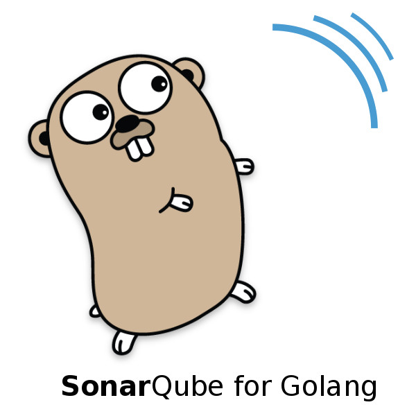

# Community SonarQube Plugin for the Go language  

[](https://travis-ci.org/uartois/sonar-golang)  



**This is a community plugin for SonarQube to support the Go language started in April 2017 at Artois University.
Since May 2018, Go is officially supported by SonarSource with [SonarGo](https://github.com/SonarSource/sonar-go).**

It integrates [GoMetaLinter](https://github.com/alecthomas/gometalinter) reports
within SonarQube dashboard.

The user must generate a GoMetaLinter report for the code using the checkstyle
format. The report is thus integrated to SonarQube using
[sonar-scanner](https://docs.sonarqube.org/display/SCAN/Analyzing+with+SonarQube+Scanner).

Release 1.0 only provides golint support. Release 1.1 provides test coverage support. Upcoming releases will bring support
for additional linters.


# Authors

+ Thibault Falque
+ Daniel Le Berre


# Installation

* Download the latest version of the artifact
* Stop sonarqube server
* Put the jar file in `$SONAR_PATH/extensions/plugins`
* Start sonarqube server

# Enabling all latest rules

If you have already installed the plugin and you want to enable the new rules provided by
the new version of the plugin, follow those steps after the installation:

* Go on the Quality Profiles page
* Click on the arrow near the "Create" button
* Click on "Restore Built-In Profiles"
* Choose the language (Go)
* Click on "Restore"


# Using the plugin

* create a `sonar-project.properties` file.

```
sonar.projectKey=yourprojectid
sonar.projectName=name of project
sonar.projectVersion=1.0
# GoLint report path, default value is report.xml 
sonar.golint.reportPath=report.xml 
# Cobertura like coverage report path, default value is coverage.xml 
sonar.coverage.reportPath=coverage.xml 
# if you want disabled the DTD verification for a proxy problem for example, true by default 
sonar.coverage.dtdVerification=false
# JUnit like test report, default value is test.xml
sonar.test.reportPath=test.xml 
sonar.sources=./
sonar.tests=./
sonar.test.inclusions=**/**_test.go
sonar.sources.inclusions=**/**.go
```

* start the analysis
```shell
sonar-scanner
```

It is assumed that you have the sonar scanner executable on your path and
to run it at the root of your go project.

# GoMetaLinter support

* install [gometalinter](https://github.com/alecthomas/gometalinter)
```shell
go get -u gopkg.in/alecthomas/gometalinter.v1
gometalinter.v1 --install
```

* Generate a gometalinter report using the checkstyle format:
```shell
gometalinter.v1 --checkstyle > report.xml
```

# Coverage (since release 1.1)

For coverage metrics you must have one or multiple  `coverage.xml` (cobertura xml format) files.

* First install the tools for converting a coverprofile in cobertura file:
```shell
go get github.com/axw/gocov/...
go get github.com/AlekSi/gocov-xml
```

* Then from the root of your project:
```shell
gocov test ./... | gocov-xml > coverage.xml
```

Note that `gocov test ./...` internally calls `go test` with the `-coverprofile` flag for
all folders and subfolders, and assembles the coverprofile accordingly by itself (this is
necessary, as Golang [up to 1.9](https://tip.golang.org/doc/go1.10#test) does not support the
combination `go test ./... -coverprofile=...`).

If you want to invoke `go test` manually, you need to do this and the conversion for each
package by yourself. For example:

* For all packages execute those commands:
```shell
go test -coverprofile=cover.out
gocov convert cover.out | gocov-xml > coverage.xml
```

You then end-up with one coverage file per directory:
```
pkg1/coverage.xml
pkg2/coverage.xml
pkg3/coverage.xml
...
```


This is an example of script for create all coverage files for all packages in one time.


```bash
for D in `find . -type d`
do
    echo $D
    if [[ $D == ./.git/* ]]; then
        continue
    elif [[ $D == .. ]]; then
        continue
    elif [[ $D == . ]]; then
        continue
    fi

    cd $D
    go test -coverprofile=cover.out
    gocov convert cover.out | gocov-xml > coverage.xml
    cd ..
done
```
or

```bash
go list -f '{{if len .TestGoFiles}}"go test -coverprofile={{.Dir}}/cover.out {{.ImportPath}}"{{end}}' ./... | xargs -L 1 sh -c
go list -f '{{if len .TestGoFiles}}"gocov convert {{.Dir}}/cover.out | gocov-xml > {{.Dir}}/coverage.xml"{{end}}' ./... | xargs -L 1 sh -c
```

> Note for docker users: by default, `gocov-xml` uses absolute paths which prevents this plugin to use
> coverage files built on a different file system than the one used to run the plugin.
> A workaround is to use a [patched version of gocov](https://github.com/Centny/gocov-xml.git) which provides
> the `-pwd` option to use relative paths instead of absolute paths. See [#35](https://github.com/uartois/sonar-golang/issues/35) for details.

# Tests (since release 1.1)

For test metrics you must generate a junit report file.

* install the tools:
```shell
go get -u github.com/jstemmer/go-junit-report
```

* run the tests from the root of your project:
```shell
go test -v ./... | go-junit-report > test.xml
```
